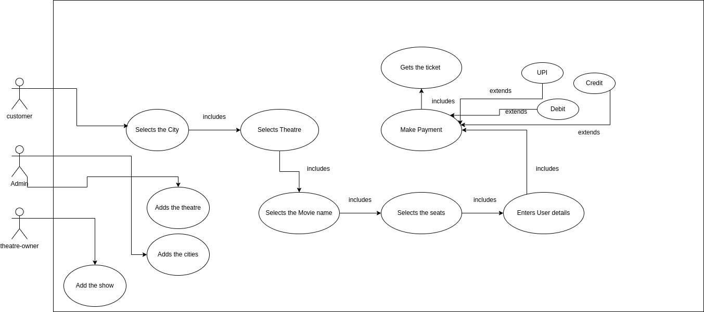

# Questions

- Are we going to write code or a class diagram is enough? 
	- Code is required. 
-  Are we going to persist the data?
	- Yes
- How will user use the system? 
	- Using GET and POST request. 

# Sketch 

## User Journey 

### Kinds of users

- Admin 
	- Adds new city
	- Adds new theatre
- Theatre Owner
	- Adds audis to the theatre. 
	- Adds shows to the theatre. 
-  Customer 
	- Select Cities. 
	- Search a Movie
	- List of theatres
	- Select theatres. 
	- List of shows. 
	- Select a show. 
	- Select seats. 
	- Make Payment 
	- Get Ticket

## Requirements:  

- BMS will have multiple cities. 
- Cities will have multiple theatre. 
- Theatre will have multiple audis. 
- Audis will have multiple seats. 
- Each Seat will have a type. 
- Audis will have available features. 
- Shows will have required features. 
- Shows has start and end time. 
- Multiple seats can be booked with a single ticket. 
- Limit number of seat allowed to be booked with 1 ticket. 
####  Behaviours 
- Status [ Available,  Locked, Booked , Not available ] is a seat in a show. 
- Price is related to seat type in the show. 

| ENUMS | CLASSES |
| --------| :----------|
|Seat Type | Cities |
|Role | Theatre | 
|Features | Audis | 
|Seat Status | Shows | 
|Theatre  Status | Tickets  | 
| Payment Mode | Payment | 
| Payment Status | User | 
|| Seat | 
| | Bill | 
| | SeatInShow | 
| | SeatTypeInShow | 

## Enums

1. SeatType: Silver, Gold, Platinum
2. Role: Admin, owner, user
3. Features: 2D, 3D, DOLBY, 4D
4. SeatStatus: available, under_maintainance, locked, booked
5. TheatreStatus: open, closed
6. Payment Mode: card, netbanking 
7. Payment Status: failed, successful, in-process 

### Classes 

|City|
|----| 
|id|
|name|
|list (theatres)|

|Theatre|
|--------|
|id|
|name|
|address|
|list (audis) |
| maxBookingSeatAllowed | 

|Audis|
|-----|
|id|
|name|
|list (Seats)|
| list (features) | 
| rows | 
| columns | 

|seat|
|----|
|id|
|number| 
|seatType | 
|Row|
|Coloumn |

|  User | 
|-------|
| id | 
| list (role)|
| username | 
|password | 

|Show | 
|------|
|id | 
|start time |
|end time |
| audi |
| name |
| list (features) | 

| seatInAShow| 
|---------------|
|id | 
|Seat | 
|show |
| seatStatus |

| seatTypeInShow | 
|----------------|
| id | 
| seatType| 
|show | 
|price |

| Ticket | 
|--------| 
|id |
|user |
|booking time|
|list (SeatInShow) |
| list (payment) | 
| user | 

| Payment | 
|----------| 
|id|
| payementStatus |
| paymentProvider|
| amount | 
| transaction id | 
|ticket | 

## Schema Design 

1. Classes & enums become table. 
2. Primitive Attributes should be the columns
		-  Primitive data types.
		- string 
		- date/time
3. Relationship : (1:1): any side FK,  (1:M): on m side FK ,  (M:M): mapping table 

- All enums as tables with two coloumns -> id and value 

1. City : id, name 
2. Theatre: id, name, address, maxSeatBookingAllowed, cityID
3. Audi: id, name, rows, coloumns, theatreId
4. User: id, name, password, username
5. Seat : id, number, row, coloumn, audiId, seatTypeId
6. Show: id, name, start_time, end_time, audiId
7. Ticket: id, booking_time, user_id
8. Payment: id, amount, transaction_id, ticket id
9. SeatInShow: id, seatIId, showId, seatStatusId
10. SeatTypeInShow: id, price, seattypeID, showId
11. AudiFeatures: id, audiId, featureId 
12. UserRole: id, userId, roleId
13. ShowFeature: id, showId, featureId

### Annotation 

#### Lombock 
	- Getter  -> Add getter methods
	- Setter -> Add the setter Methods

#### Model 
-  Entity -> For creating table 
-  MappedSuperClass -> to make properties part of another table 
-  Id -> To treat it as primary key
-  GeneratedValue -> For auto increment 

#### Relationship 
- OneToMany (mappedBy="")
- ManyToOne
- OneToOne
- ManyToMany

#### Enums
- Enumerated -> For enums
- ElementCollection -> For list of enums 

- Rather than creating dependency object and then injecting in the constructor we could use following annotations of springboot: 
#### Dependency Injection 
	- Controller
	- Autowired
	- Service
	- Repository 

### Concurrency Problem 

If user1 selected A1 and A2 seat at 9:05 and user2 selected A2 and A3 seats at 9:05. User 1 clicked on book ticket at 9:06 and user2 at 9:07. 

Locked the seat A1 and A2 at 9:06 and dummy ticket is generated. 

##### Flow: 

  1. Get showSeats of selected IDs  
  2. Check if they are avaialabe.  
  3. If not available, send back with an exception
  4. else Lock them 
  5. Prepare dummy ticket  
  6. Return Ticket 

#### Ideal Flow: 

Selected Seat -> Locked -> Login -> sent to Payment Gateway -> Pay -> Success -> Redirected to BMS-> Success -> Ticket Status Booked

**- What will be added in the the dummy ticket and when?** 
	Select (ShowSeatId) -> Login (UserId) -> Pay (PaymentId)

| Payment | Redirection | Status | 
|----------| -------------| -------|
|	Success| Success | Booked |
| Success | Failed | Locked and Refund should be initiated | 
|Failed | Success | Not Booked and locked | 
|Failed | Failed | Locked | 

- Locked should be considered available after 6 minutes. 
- Locked : Now - lockedAt < 6 minutes -> locked else consider it available. 

If redirection succeed, then BMS knows what to do and what actually happened.  

### Refunds 

- Reconciliation 
	- BookMyShow and Payment Gateway maintains files at their end for all the entries. 
	- Files are compared get the difference (Breaks). 
	- Refund needs to be initiated. 
	- External Breaks: External party have additional entries. 

### Transaction 

SET TRANSACTION ISOLATION LEVEL SERIALISABLE

- Read with lock (Select for update)
- Check in App 
- Update 

- ORM
- Pessimistic Read/Write 
- Different types of locks in Transactional 

